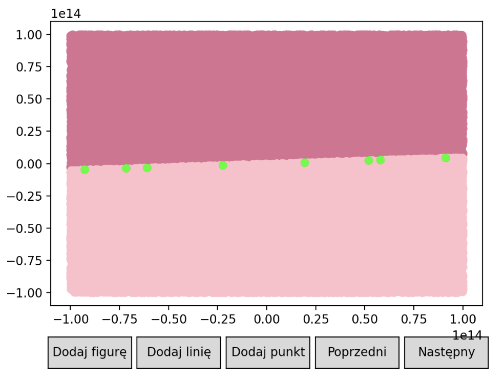

# 🔶 The objective of the exercise 🔶

The exercise consists of comparing and contrasting the results of classifying the position of points relative to a line segment, depending on the calculation precision, zero tolerance, and the method used to calculate the determinant. 

The task was accomplished by employing a function that assesses the determinant and categorizes points based on their position relative to the line. This process was repeated for every set of points, employing each of the four determinant calculation methods and various selected zero tolerances. 

# 🔶 Results for example dataset 🔶

The classifications were visually represented by corresponding colors: 

<ul>
  <li>A shade of deep pink - denoting points positioned on the left side of the line, </li>
  <li>A shade of light pink - indicating points positioned on the right side of the line, </li>
  <li> A shade of green - signifying points located precisely on the line itself. </li>
</ul>

