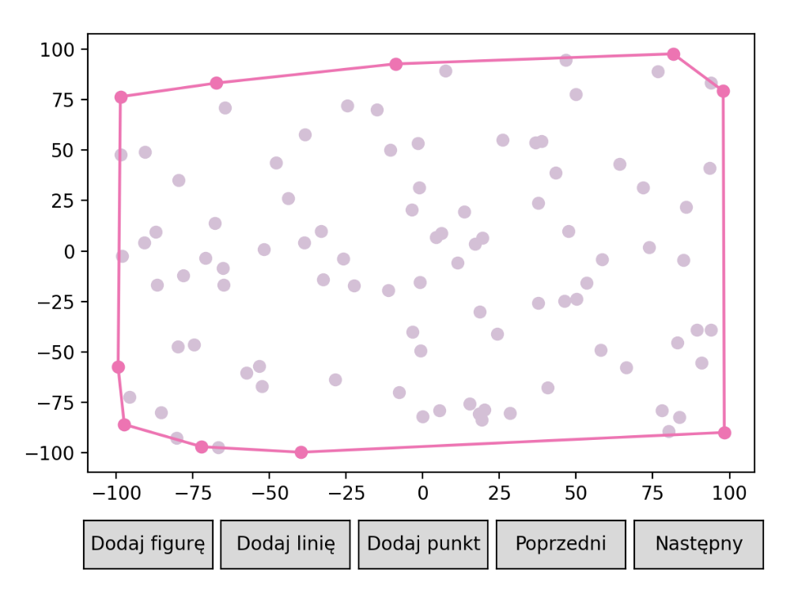
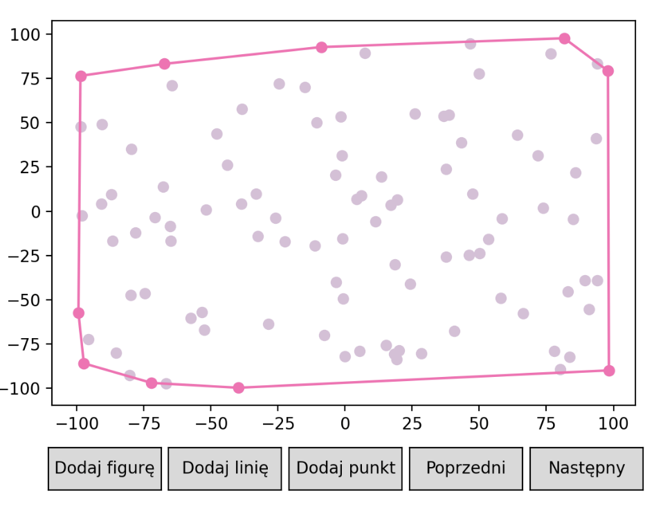

# 🔶 The objective of the exercise 🔶

 The exercise involved implementing the Graham and Jarvis algorithms for computing convex hulls. Then, it was necessary to test their performance on different datasets and measure their execution time. 

 The algorithms for computing convex hulls were the subject of my semester course on Geometric Algorithms. 
  You can find more implemented algorithms for computing convex hulls <a href="https://github.com/YoC00lig/Convex-Hull">in this repository</a>. 

# 🔶 Results for example dataset 🔶

<h3> 🔸 Graham </h3>

 The Graham algorithm, also known as the Graham scan, first finds the point with the lowest y-coordinate (or the leftmost point in case of a tie). It then sorts the remaining points based on their polar angle with respect to this point and constructs the convex hull using a stack.

<h3> 🔸 Jarvis </h3>

 The Jarvis algorithm, also known as the gift wrapping algorithm, is a simple approach for computing the convex hull. It starts with the leftmost point and iteratively selects the next point that forms the smallest angle with the current edge. 

