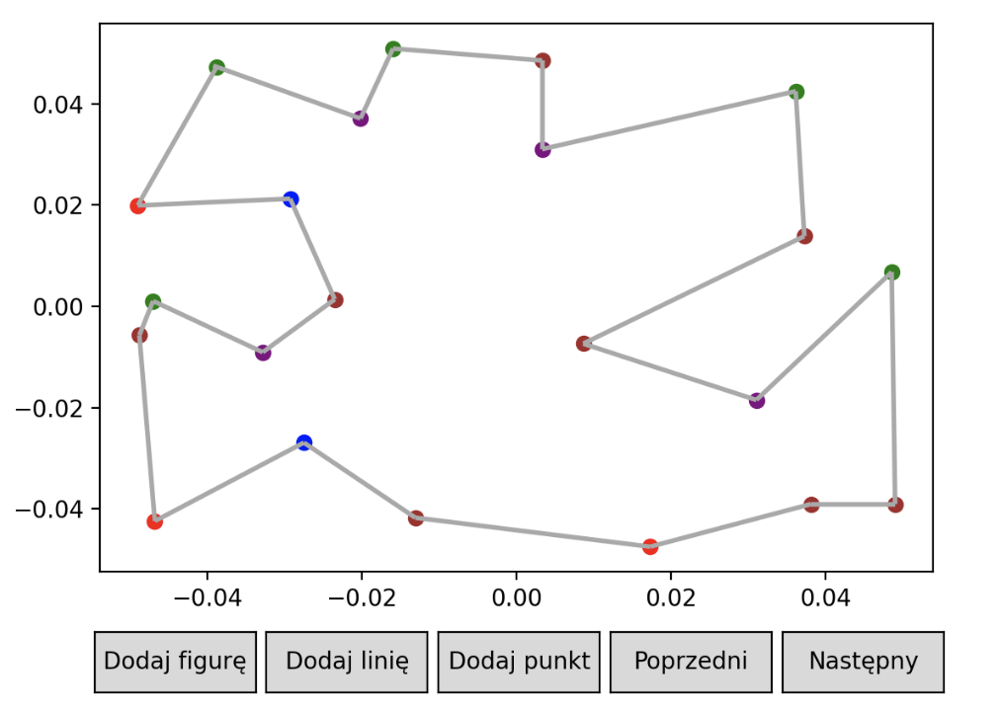
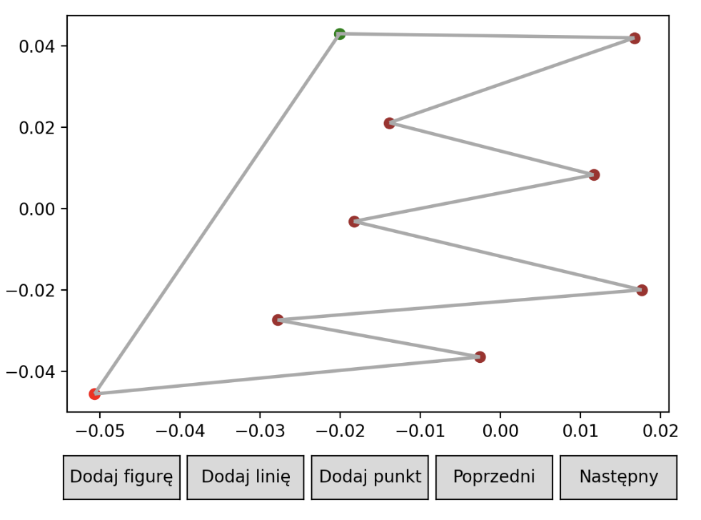
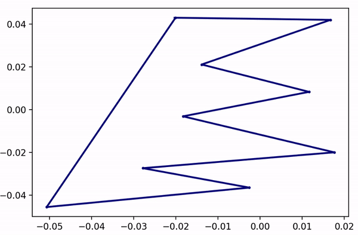

# 🔶 The objective of the exercise 🔶

 The exercise consisted of implementing an algorithm for triangulating a y-monotone polygon. To achieve this, the following functions also needed to be implemented: 

<ul>
  <li> Checking if the polygon is y-monotone. </li>
  <li> Coloring the vertices according to specified conditions. </li>
  <li> Generating the data. </li>
</ul>

 In the exercise, it was possible to load any polygon using the graphical interface of the matplotlib library.
The input involved reading the polygon's points in a counterclockwise direction. 

 The algorithm for triangulating a y-monotone polygon is used to decompose a polygon into triangles in a specific way. It handles y-monotone polygons, 
  which are polygons where any horizontal line intersects the polygon at most twice. 
  The algorithm is commonly used in computational geometry for various applications. 

  
  
 It is widely employed in computer graphics for generating triangular meshes for polygons, which is crucial for 3D graphics rendering. Furthermore, it finds applications in geodetic analysis, physical simulations, numerical computations, and robot path planning. The algorithm is also utilized in areas such as image processing, spatial data processing, and geographic information systems. 

# 🔶 Results 🔶

<h3> 🔸 Coloring the vertices according to specified conditions. </h3>

Each color represents something different: 

<ul> 
  <li><b>beginning (green color)</b> - The starting vertex represents the initial point of the polygon. It is the first vertex encountered during the traversal of the polygon. </li>
  <li><b>ending (red color)</b> - The ending vertex represents the final point of the polygon. It is the last vertex encountered during the traversal of the polygon. </li>
  <li><b>correct (brown color)</b> - The correct vertices are the valid vertices of the polygon that do not fall into any other category. These vertices are neither starting nor ending points and do not participate in dividing or connecting edges. </li>
  <li><b>dividing (blue color)</b> - The dividing vertices are the vertices of the polygon that divide the edges of the polygon. They have both preceding and succeeding edges above the current vertex. </li>
  <li><b>connecting (purple color)</b> - The connecting vertices are the vertices of the polygon that connect the edges of the polygon. They have both preceding and succeeding edges below the current vertex. </li>
</ul>

<h3> 🔸 Checking if the polygon is y-monotone. </h3> 

The y_monotonicity function checks for the y-monotonicity of a polygon. It counts the number of local minima within the polygon by comparing the y-coordinates of each vertex with its adjacent vertices. If there is exactly one local minimum in the polygon, the function returns True; otherwise, it returns False.

The above polygon is not monotonic; therefore, for the purpose of demonstrating the triangulation in the subsequent part of the readme, a different polygon was created. 

<h3> 🔸 Triangulation a y-monotone polygon. </h3> 

Below is a visualization of the algorithm's operation, which will help to better understand its functionality. 

