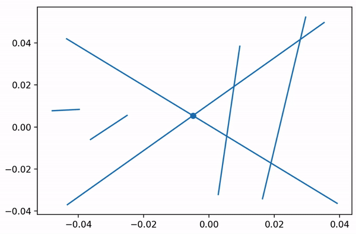

# 🔶 The objective of the exercise 🔶

The objective of the exercise was to implement two algorithms. The first algorithm aimed to verify whether among the given line segments, there exist at least two segments that intersect. The second algorithm aimed to determine all intersections among the given line segments. The exercise utilized the sweep line algorithm for implementation. The implementations also allowed for step-by-step visualizations of the algorithms. 

Each dataset can be saved as a list of line segments in a .json file. Two functions were created for data saving and loading from a file. Generating datasets can be done in two ways: using the function that generates line segments using random.uniform, which randomly selects coordinates for the segments from a specified range, or using the graphical tool that allows inputting line segments using a mouse. 

In short, Priority queue Q was used as the event structure, and SortedSet from the sortedcontainers library was used as the state structure. 

# 🔶 Results 🔶
<h3> 🔸 One intersection detection </h3>

 Events are added to a priority queue with appropriate markings to distinguish between the start and end of line segments. The sweep line is positioned, and event handling checks for intersecting segments with neighbors. If an intersection is found, the loop is terminated and True is returned; otherwise, False is returned. 

Event handling: 

<ul>
  <li>Start of a line segment - if the segment has neighbors, it is checked whether it intersects with them. </li>
  <li>End of a line segment - check if the neighbors (if they exist) of the segment being removed from the state structure intersect. </li>
  <li>If an intersecting segment is found in any of the cases, the loop is interrupted, and True is returned. Otherwise, False is returned. </li>
</ul>

<h3> 🔸 All intersections detection </h3>

 The previous algorithm has been modified (mainly the event handling) to compute all intersections.

Event handling: 

<ul>
  <li> Start of a line segment - If the segment has neighbors, a check is performed to determine if it intersects with them. If there is an intersection, the intersection point is inserted into the event structure at the appropriate position with the corresponding marking.</li>
  <li> End of a line segment - Verification is done to check if the neighbors (if they exist) of the segment being removed from the state structure intersect. If there is an intersection, the intersection point is inserted into the event structure at the appropriate position with the corresponding marking.</li>
  <li> Intersection point of two line segments - The two line segments are removed from the state structure, and the x-coordinate of the sweep line is updated to the current value with a slight shift (10^-6). Then, the line segments are reinserted, swapping their positions in the sweep line structure. It is checked whether the line segments intersect with their new neighbors.</li>
</ul>

 To prevent duplicates, a set was created to store information about detected intersection points.

